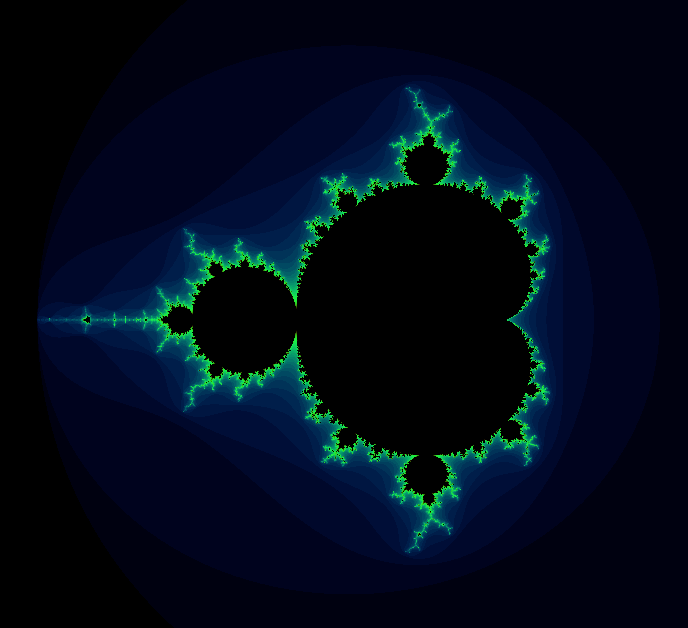

# fract-ol
This was my first ever graphics project in my C learning journey at 42 Porto. The goal is to render beautiful fractals.

<p align="center">
  
</p>

## Features and Controls
- Zoom to mouse pointer: mouse and scroll
- Increment/decrement value of Julia set constant: keys j/k
- Alternate the fractal colors with left mouse button
- Switch to Mandelbrot set: key 1
- Switch to Julia set: key 2
- Close the window and terminate program: Esc

## Instalation
Start by cloning the repository:
```
git clone git@github.com:jsobreir/42_fract-ol.git
```

then, inside the repository, install the dependencies:
```
make clone
```

## Executing
To execute the program you first need to compile it by typing `make` on your terminal.
When the program compiles successfully you can type
```
.\fractol <set_name> <option 1: c_re> <option 2: c_im>
```
substituting **<set_name>** by the name of the set (either mandelbrot or julia) and the two options by the appropriate coordinates where you want to plot the Julia set (these coordintaes only work for the Julia set).

## Future improvements
In order to make the experience of navigating the fractal more fluid and interesting, some features I plan to add (out of the scope of the 42 curriculum) are:
- Multithreaded pixel calcualation to make the rendering faster
- Smoother coloring functions with psycadelic tones
- Ability to use the left mouse button to drag the fractal
